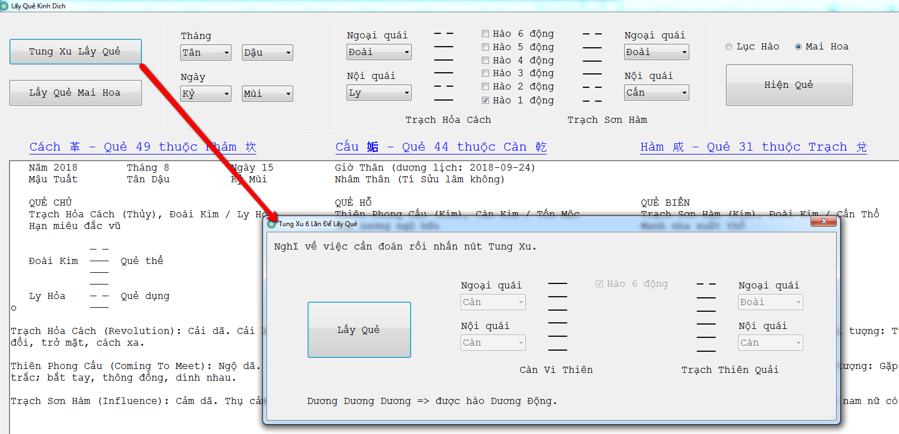
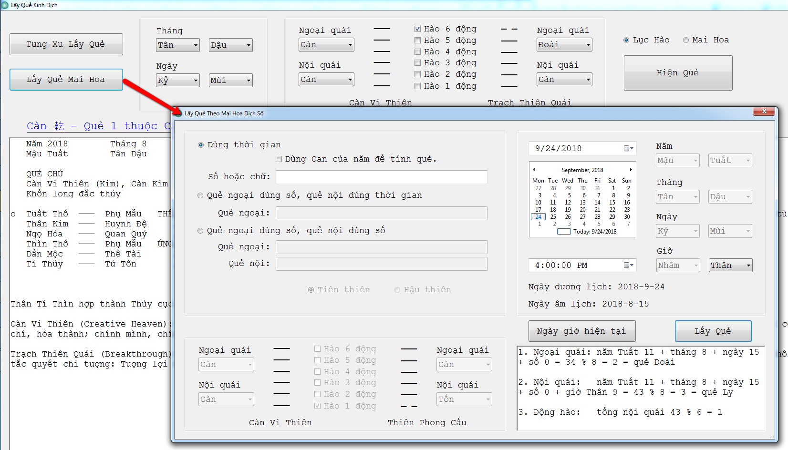
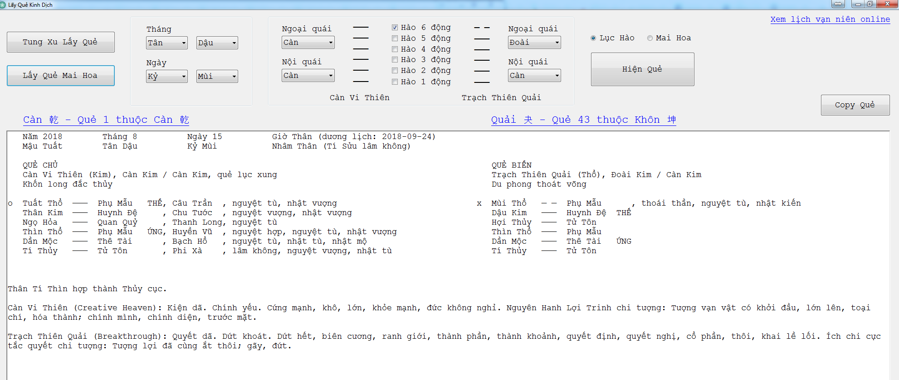
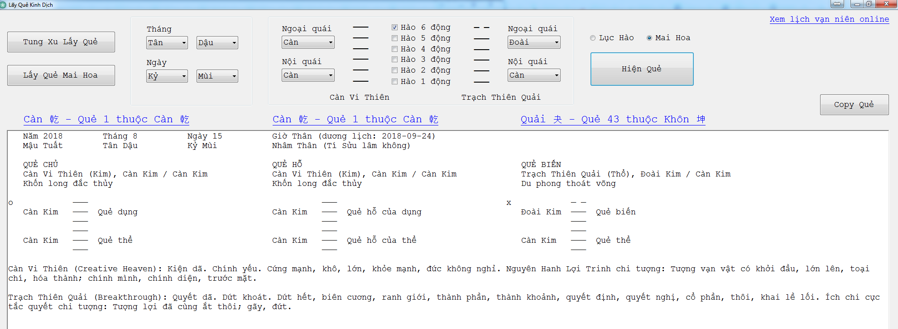

# Lấy Quẻ Kinh Dịch

Chương trình hỗ trợ các bạn học Kinh Dịch lấy quẻ, kiểm tra các quẻ khi đọc sách.

**Một số tính năng chính của chương trình:**

- Tung xu lấy quẻ
  
- Lấy quẻ theo Mai hoa dịch số (thời gian, tiên thiên số, hậu thiên số)
  
- Hiển thị quẻ theo lục hào
  
- Hiển thị quẻ theo mai hoa
  

**Ghi chú:**

- Người dùng có thể tùy chọn quẻ theo ý mình để xem, không nhất định phải lấy quẻ trước.
- Các quẻ đều có ghi chú theo Việt Dịch (sẽ cập nhật các tính năng cho Việt Dịch ở phiên bản kế tiếp).
- Download phiên bản mới nhất trong mục Release (https://github.com/niceboomer/kinhdich/releases)

Vui lòng cho ý kiến nếu thấy chương trình cần cải tiến gì.

Xin cảm ơn.

